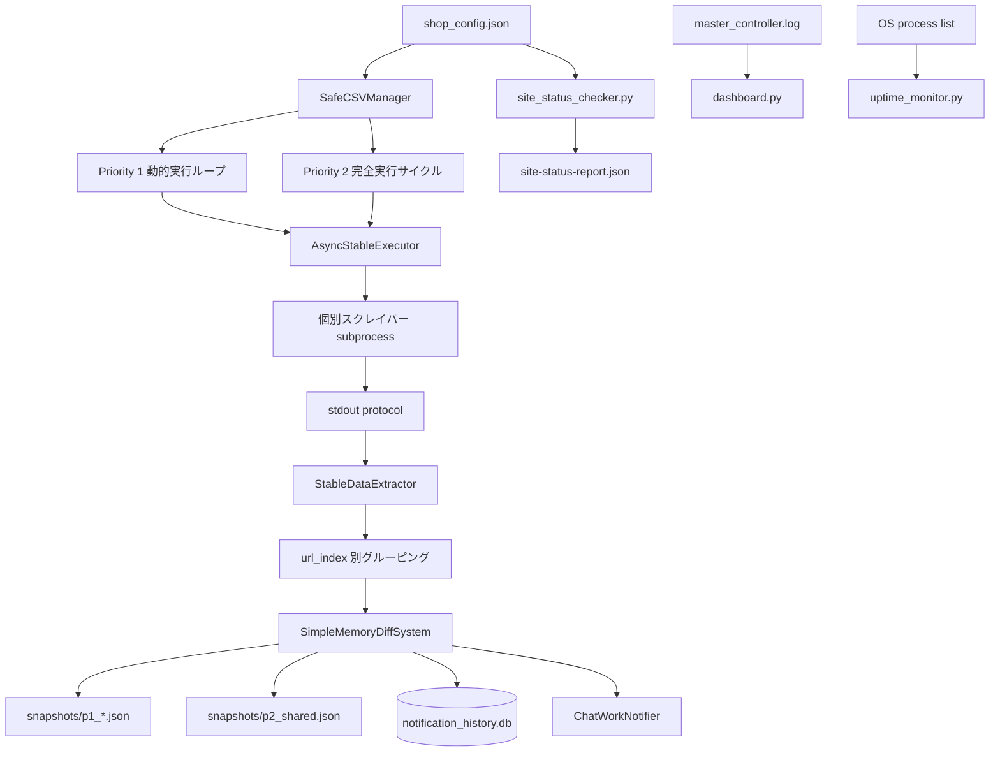

# Master Controller システム設計・改修ガイド

> **調査基準日:** 2026-07-15  
> **調査対象:** `main` / commit `8fb7ee97897bf661d4d4b2bf225abf0d77404785`  
> **目的:** Codex・Claude Code・人間の開発者が、既存の通知挙動を壊さずにスクレイパーと統合制御を改修できる状態を作る。

---

## 1. この文書の位置づけ

この文書は、現行コードを読解して復元した**実装ベースの正本**である。

現行 `README.md` には、リポジトリ名、起動ファイル、バージョン、監視件数、依存関係などに過去版の記述が混在している。改修判断では、次の優先順位で情報を扱うこと。

1. 実行中のコードと `shop_config.json`
2. 本文書
3. `AGENTS.md` / `CLAUDE.md`
4. `README.md`（概要・背景の参考）
5. `bu/` 配下（履歴・比較用。現行仕様ではない）

---

## 2. システムの本質

本システムは、個別のWebスクレイパーを**標準出力プロトコル**で束ねる親プロセス型の監視基盤である。

各スクレイパーは商品データを標準出力へ出すだけでよい。親プロセスが以下を担当する。

- 実行スケジュール
- subprocess起動とタイムアウト
- Playwright系スクリプトの並列数制御
- 商品データの抽出
- URLカテゴリ別の振り分け
- 1位商品の差分検知
- 重複通知防止
- ChatWork通知
- スナップショット保存
- 稼働統計と監視レポート



---

## 3. 実行時の正本ファイル

| 役割 | 現行ファイル | 注意点 |
|---|---|---|
| 統合制御 | `master_controller_v29.py` | ファイル名はv29だが、内部 `VERSION` と表示文言はv27のまま |
| URL・通知・優先度設定 | `shop_config.json` | 1行ではなく、1オブジェクトが1監視URL/カテゴリ |
| 個別スクレイパー | ルート直下の各 `.py` | `bu/` ではなくルート直下が現行候補 |
| サイト到達性監視 | `site_status_checker.py` | HTTP 200と応答時間を確認。商品取得可否は確認しない |
| Web監視画面 | `dashboard.py` | `/root/scraper` とログ文言へ強く依存 |
| ログストリーム | `log_viewer.py` | FastAPIでログ表示 |
| 稼働時間監視 | `uptime_monitor.py` | OSプロセスを検出しSQLiteへ記録 |
| 現行環境の依存一覧 | `requirements_current.txt` | OS全体のfreezeに近く、プロジェクト最小依存ではない |
| 過去版・退避 | `bu/` | 原則変更禁止。現行コードの探索対象から除外する |

2026-07-15のコミット済みステータスレポートでは、84 URLを確認し、82件正常・2件異常となっている。ただしこれは実行時点の観測値であり、`shop_config.json` の変更で変動する。

---

## 4. 起動とライフサイクル

### 4.1 通常の起動

```bash
export CHATWORK_TOKEN='...'
python3 master_controller_v29.py
```

親プロセス起動時に以下が初期化される。

1. `SafeCSVManager` が `shop_config.json` を読む
2. activeな設定からP1/P2のスクリプト一覧を作る
3. `SimpleMemoryDiffSystem` が `snapshots/` と通知履歴DBを準備する
4. `ChatWorkNotifier` が環境変数 `CHATWORK_TOKEN` を必須検証する
5. `PlaywrightSemaphore(max_concurrent=3)` を作る
6. P1ループ、P2サイクル、統計ループを `asyncio.gather()` で並行起動する

### 4.2 subprocess実行

個別スクレイパーは次の形式で実行される。

```python
subprocess.run(
    [sys.executable, "-u", str(script_path)],
    capture_output=True,
    text=True,
    encoding="utf-8",
    errors="replace",
    timeout=SUBPROCESS_TIMEOUT,
    cwd=str(script_path.parent),
)
```

重要な帰結:

- コマンドライン引数は渡されない
- `shop_config.json` のURLは子プロセスへ渡されない
- 各スクレイパー自身が対象URLとURL順序を保持する
- 子プロセスの作業ディレクトリはスクリプト所在ディレクトリ
- 標準出力が商品データ契約になる
- デフォルトタイムアウトは120秒

---

## 5. スクレイパー標準出力プロトコル

### 5.1 単一URL

```text
商品名A 12800円
商品名B 49800円
```

### 5.2 複数URL

```text
---URL_INDEX:0---
商品名A 12800円
商品名B 49800円
---URL_INDEX:1---
商品名C 22000円
```

`url_index` は `shop_config.json` とスクレイパー内部URL配列で完全一致させる。

### 5.3 画像URL付き

```text
商品名A 12800円||https://example.com/image.jpg
```

現在の親パーサーが正式に扱う `||` 後段は**画像URLの1要素だけ**である。

```text
商品名||商品詳細URL||画像URL
```

のような3要素形式へ勝手に拡張してはならない。`hardoff.py` はこの互換性制約を明示している。

### 5.4 パース条件

`StableDataExtractor` の主な条件:

- 価格表現: `12,800円`、`¥ 12,800` など
- 有効価格: 100〜10,000,000
- 商品名: 4文字以上
- 商品名は最大200文字
- stdout全体の最大サイズ: 1,000,000文字
- URL markerがない場合は `url_index=0`
- 次の語を含む行は商品候補から除外される
  - `info`, `error`, `debug`, `warning`, `log`, `traceback`
  - `selenium`, `driver`, `browser`, `playwright`

商品名にこれらの語が含まれる場合も除外され得るため注意する。

### 5.5 終了コード契約

親プロセスは現在、次の両方を満たした場合のみ成功扱いする。

```python
result.returncode == 0 and parsed_product_count > 0
```

したがって、利用可能な商品が得られた状態で終了コード1を返すと、親側は取得データを失敗扱いする。

複数URLの一部だけ失敗した場合でも、**利用可能なstdoutを親へ渡したいスクレイパーは終了コード0を返す**必要がある。終了コード1を「部分成功」に使う現行スクレイパーは、親との契約上の不整合を抱えている。

---

## 6. 設定ファイルの実際の意味

標準例:

```json
{
  "py_file": "example.py",
  "display_name": "店舗名",
  "category": "新着",
  "scraping_url": "https://example.com/items",
  "priority": 2,
  "is_active": true,
  "notification_enabled": "385402385",
  "custom_interval": 300,
  "url_index": 0
}
```

| キー | 実際の意味 |
|---|---|
| `py_file` | 実行するルート直下スクリプト名 |
| `display_name` | 通知・スナップショットで使う店舗名 |
| `category` | URLごとのカテゴリ名 |
| `scraping_url` | 通知リンクおよび到達性監視URL。子スクレイパーには渡されない |
| `priority` | 1=P1、2以上=P2 |
| `is_active` | activeな行のみ実行対象 |
| `notification_enabled` | 実態はChatWorkルームID。カンマ区切り複数可。boolean名は誤解を招く |
| `custom_interval` | 現行マスターでは未使用 |
| `url_index` | stdout marker、内部URL配列、通知カテゴリを結ぶ整数キー |

### 6.1 一意性

差分検知のサイトキーは次の文字列である。

```text
{display_name}_{category}
```

同じ組み合わせを複数設定へ使うとスナップショットが衝突する。

### 6.2 同一スクリプトの優先度

優先度マッピングは `py_file` 単位で上書きされる。1つのスクリプトにP1とP2の設定行を混在させる設計は避ける。

---

## 7. スケジューリング

### 7.1 Priority 1

時刻が1:00〜7:59の場合は30分固定。

日中は「最後の新商品時刻」からの経過時間で意図上は変化する。

| 無更新時間 | 間隔 |
|---|---:|
| 30分未満 | 60秒 |
| 30〜60分 | 300秒 |
| 60分以上 | 3600秒 |

ただし現行 `_execute_with_interval_tracking()` は、**新商品検知時ではなく、商品を1件以上取得できた成功実行ごとに** `last_new_product_time` を更新する。そのため正常取得が続くP1は、実質60秒へ張り付きやすい。

### 7.2 Priority 2

- 同時実行数: 1
- 全スクリプトを順番に一巡
- 一巡後、日中は5分周期を目標に待機
- 深夜は30分周期を目標に待機
- 未実行扱いのスクリプトを次サイクル先頭へ再投入

`custom_interval` はこの制御へ反映されない。

### 7.3 Playwright並列制御

親はソース文字列に以下が含まれるかでPlaywrightスクリプトを推定する。

- `playwright`
- `async_playwright`
- `browser.new_page`

セマフォ取得の待機は5秒。取得できない場合、現行実装は商品0件かつ `success=True` を返すため、統計上の成功と実データ取得が一致しないことがある。

---

## 8. 差分検知と通知

### 8.1 基本アルゴリズム

各サイト/カテゴリについて、前回の1位商品だけを記憶する。

1. 初回実行
   - 現在1位を保存
   - 通知しない
2. 現在1位が前回1位と同じ
   - 変更なし
   - タイムスタンプだけ更新
3. 前回1位が現在一覧の途中にある
   - 前回1位より上の商品を新商品と判定
4. 前回1位が一覧から消えた
   - 現在上位20件を新商品候補と判定

この方式は「新着順が保証された一覧」を前提にする。スクレイパーがDOM順を崩すと大量誤通知につながる。

### 8.2 商品キー

優先順位:

1. 商品名中の8文字以上の英数字コード
2. 画像URL（クエリ文字列除去）
3. 正規化した商品名

最終的にMD5先頭8文字をキーにする。

価格は基本の商品識別キーへ含まれない。そのため、同じ商品名/画像の価格変更だけでは通常通知されない。

### 8.3 スナップショット

- P1: `snapshots/p1_{script}_{url_index}.json`
- P2: `snapshots/p2_shared.json`

P1はファイル競合と障害範囲を分離している。P2は共有ファイルのため、破損時の影響範囲が広い。

### 8.4 通知履歴

`notification_history.db` のSQLite WALモードを使用する。

- クールダウン: 6時間
- 古い履歴の保持目安: 24時間
- DBエラー時の `should_notify()` は安全側として `False` を返し、通知を抑止する

注意: 大量削除後の `VACUUM` がトランザクション内で実行される可能性があり、SQLiteの制約と衝突し得る。

### 8.5 ChatWork

通常スクレイパーはChatWorkへ直接通知せず、親へ商品を返す。

例外として `tresure.py` などの独立監視プログラムは、自前の状態・ループ・通知を持つ。これらを通常のone-shotスクレイパーと混同しない。

---

## 9. スクレイパーの分類

### A. 軽量requests/BeautifulSoup型

HTMLが静的なサイト向け。単純だが、例外を握りつぶす実装が多い。

例:

- `akasaka_camera.py`
- `antiquary.py`
- `comphotocamera.py`
- `hatosya.py`
- `koseki_camera.py`
- `sanpo.py`

### B. Playwright型

JavaScriptレンダリング、動的ロード、bot対策があるサイト向け。

例:

- `hardoff.py`
- `naniwa.py`
- `wonderrex.py`
- `nisshindo.py`
- `kanto_camera.py`

### C. エンタープライズ実装型

Circuit Breaker、Retry、dataclass、構造化ログ等を各ファイル内へ持つ。品質は高い一方、重複コードが多く、終了コード契約が親と合わない例がある。

### D. 独立常駐監視型

親から1回呼ばれて終了する契約ではなく、自前で無限ループする。

- `tresure.py`
- Clique2002関連の一部監視スクリプト

これらを `shop_config.json` の通常実行対象に入れると、subprocess timeoutや二重通知を招く。

### E. 履歴・退避

- `bu/`

現行の改修では触らない。比較や復旧の資料としてのみ使う。

---

## 10. 周辺監視

### 10.1 `site_status_checker.py`

- activeな設定行を直列で確認
- 各URLをPlaywrightで開く
- HTTP 200を正常とする
- 10秒超を遅延とする
- 1URLごとに1秒待つ
- `site-status-report.json` を更新
- 異常または遅延時だけ管理ルームへ通知

**確認できないもの:** CSSセレクタの破損、商品0件、stdout契約、並び順、差分通知。

### 10.2 `dashboard.py`

- `/root/scraper` を固定参照
- `master_controller.log` を正規表現で解析
- `/api/stats` を10秒ごとに画面から取得
- Tailwind CDNを利用

注意:

- 現行マスターと期待ログ文言に差がある
- URL数と成功スクリプト数を混在させている
- P2総数を35と固定推定している
- CORS `*` とcredentials許可は公開配置に不向き
- `templates/dashboard.html` とinline HTMLが二重管理

### 10.3 `uptime_monitor.py`

- `python` かつコマンドラインに `master_controller` を含むプロセスを探す
- セッション開始/終了を `uptime_stats.db` へ保存
- 1日1回のChatWork稼働レポートを送る

---

## 11. 最優先の既知リスク

### P0: 認証情報

複数のPython・shellファイルにChatWorkトークンと見られる値が直書きされている。

対応:

1. 既存トークンを漏洩前提で失効・再発行
2. 全実行ファイルを `CHATWORK_TOKEN` 環境変数へ統一
3. systemd/secret manager/VPS環境変数で注入
4. Git履歴からの削除要否を判断
5. 文書・Issue・ログへ値を貼らない

### P0: runtime artifactのGit管理

`.gitignore` がなく、DB、ログ、スナップショット、スクリーンショット、通知履歴、レポートがコミットされ得る。

### P1: 終了コード不整合

部分成功を1で返すスクレイパーの有効データを親が破棄する。

### P1: バージョンと運用手順のドリフト

- `master_controller_v29.py` 内部表示はv27
- READMEの起動例はv24
- READMEのclone先名は実リポジトリと異なる
- READMEが参照する `requirements.txt` は存在しない

### P1: テスト・CI不在

stdout契約、url_index、差分検知、設定整合性を自動検証する仕組みがない。

### P1: P1間隔更新の意味不整合

「新商品検知時」ではなく「商品取得成功時」に最終更新時刻が動く。

### P2: URL二重管理

`shop_config.json` とスクレイパー内部のURL配列を人手で同期している。

### P2: 例外握りつぶし

`except: pass` により、正常な0件・DOM変更・通信障害を区別できないスクレイパーがある。

---

## 12. 安全な改修レシピ

### 12.1 既存サイトのセレクタ修正

1. `shop_config.json` から対象 `py_file` と全 `url_index` を確認
2. スクレイパー内部のURL配列順を確認
3. 商品順序が新着順か確認
4. セレクタだけを最小変更
5. stdoutにログが混ざっても商品パーサーへ誤認されないことを確認
6. 全URL markerが出ることを確認
7. 終了コード0を確認
8. 初回スナップショットを本番で消さない

### 12.2 既存スクリプトへURLを追加

1. 内部URL配列へ末尾追加
2. `---URL_INDEX:n---` を必ず出す
3. `shop_config.json` へ同じindexの行を追加
4. `display_name + category` を一意にする
5. 通知ルームを確認
6. 既存indexを並べ替えない

既存indexの並べ替えは、カテゴリとスナップショットの対応を壊すため原則禁止。

### 12.3 新規スクレイパー追加

1. one-shotで開始・終了する
2. stdout契約に従う
3. 商品を新着順で出す
4. 価格と商品名を検証する
5. timeout内で終える
6. `shop_config.json` へ追加
7. P1は本当に高頻度が必要な場合だけ使用
8. 初回は通知されないことを理解する

### 12.4 親コントローラーの改修

必ず以下を回帰確認する。

- 単一URL stdout
- 複数URL marker
- 画像URL付き2要素形式
- 初回通知スキップ
- 1位不変
- 前回1位が2位へ下がるケース
- 前回1位消失
- 6時間クールダウン
- P1/P2スナップショット分離
- ChatWork未設定時の起動失敗
- SIGINT停止

### 12.5 通知文言の変更

`ChatWorkNotifier` と `HardOffFormatter` を対象にする。スクレイパー側で通知文を作らない。

---

## 13. 最低限の検証コマンド

### 構文確認

```bash
python3 -m py_compile master_controller_v29.py
python3 -m py_compile TARGET_SCRAPER.py
```

### 個別実行

```bash
python3 TARGET_SCRAPER.py > /tmp/scraper-output.txt
printf 'exit=%s\n' "$?"
head -100 /tmp/scraper-output.txt
```

### 親パーサーへの投入

```bash
python3 - <<'PY'
from pathlib import Path
from master_controller_v29 import StableDataExtractor

text = Path('/tmp/scraper-output.txt').read_text(encoding='utf-8')
result = StableDataExtractor().extract_stable(text, 'TARGET_SCRAPER.py')
print('success:', result['success'])
print('count:', result['count'])
print('url_indexes:', sorted({p['url_index'] for p in result['products']}))
print('first:', result['products'][:1])
PY
```

### 設定整合性の確認項目

- activeな `py_file` が存在する
- 同一スクリプト内のpriorityが統一されている
- `url_index` に重複・欠落がない
- `display_name + category` が一意
- 通知ルームIDが意図どおり
- スクレイパーの内部URL順と一致

---

## 14. 推奨改善ロードマップ

### Phase 0: 事故防止

- ChatWorkトークンの即時ローテーション
- 全ハードコード削除
- `.gitignore` 追加
- runtime artifactを追跡対象から外す

### Phase 1: 契約を固定

- stdoutプロトコルのpytest化
- 終了コード契約を統一
- `shop_config.json` のJSON Schema化
- active script存在・index整合性テスト
- 最小 `requirements.txt` または `pyproject.toml` 作成
- READMEとバージョン表示の修正

### Phase 2: 実装の共通化

- 共通 `scraper_core/` パッケージ
- Retry/Circuit Breaker/Validator/Loggerの重複排除
- URLを設定から子プロセスへ渡す設計
- product URLを正式データモデルへ追加
- price-changeイベントを新商品イベントから分離

### Phase 3: 運用の可観測性

- ログ文言解析から構造化JSONイベントへ移行
- ダッシュボードの固定パス撤廃
- URL単位の成功率、取得件数、0件連続回数を記録
- ヘルスチェックと商品取得チェックを分離
- CIで代表サイトのfixtureテストを実行

---

## 15. 改修時の判断原則

1. **商品順序はデータそのもの**。並びを変えない。
2. **stdoutはAPI**。見た目のログではない。
3. **url_indexは外部キー**。既存値を再利用・並べ替えしない。
4. **初回スナップショットは通知抑制装置**。不用意に削除しない。
5. **通常スクレイパーはone-shot**。常駐ループを入れない。
6. **有効データがあるなら親が読める終了コードを返す**。
7. **秘密情報をコードへ置かない**。
8. **`bu/` を現行コードとして修正しない**。
9. **大規模リファクタより、契約テストを先に追加する**。
10. **READMEではなく実コードを検証してから判断する**。
